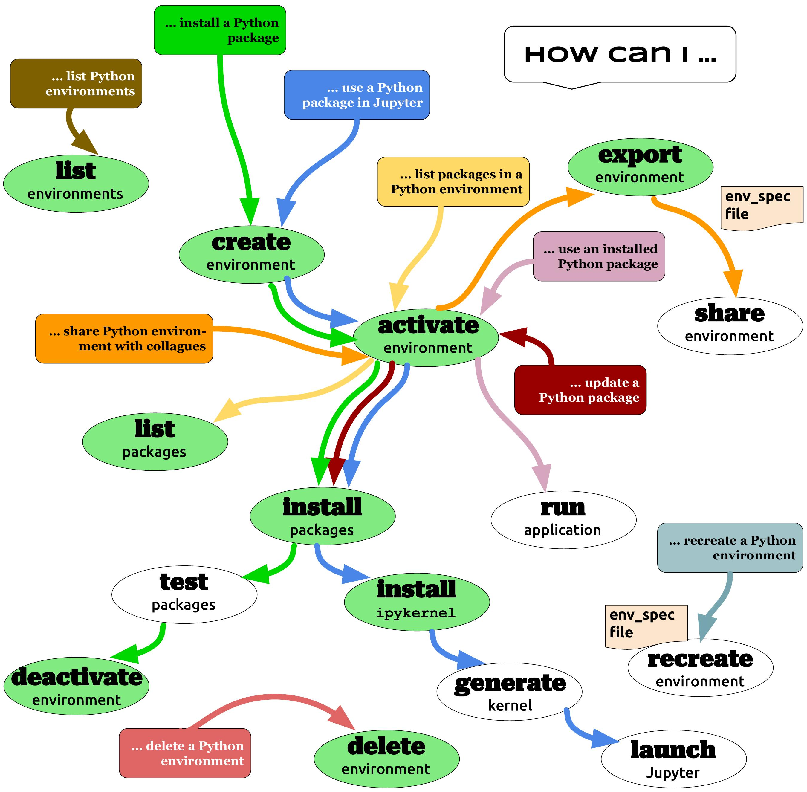

Introduction
============

Over the last few years the popularity of Python has grown tremendously
in the HPC domain. As a programming language, Python provides
significant benefits to HPC scientists
:cite:`why-python,nih-hpc`––i) Python codes are often
simpler to write and understand compared to compiled codes likes C or
Fortran, ii) it gives scientists the power of object-oriented
programming, iii) application performance can be improved by using
lower-level C/Fortran libraries, and iv) scientists can use an abundance
of Python libraries to boost their productivity. In recent years, rapid
advances in AI/ML and data analytics, and the growth of interactive
computing platforms (Jupyter notebooks) have further highlighted the
need for Python in HPC. However, despite all its benefits, scientists
often find it difficult to manage their Python packages in HPC
environments which is a non-trivial problem. The application runtimes
and environments on HPC systems are significantly different from
personal computers. As a result, support staff at HPC centers have to
regularly help scientists troubleshoot their Python installations which
leads to loss of productivity :cite:`conda-env-mod-paper`.
Below we highlight some of the reasons why managing Python packages in
an HPC environment is hard.

Challenges for installing python packages on HPC clusters
---------------------------------------------------------

In a multi-user environment such as an HPC cluster, users do not have
write access to the root Python installation (also referred to as
``base`` in Python terminology). HPC center staff manage the central
Python installations on these clusters which are typically available to
the users via environment modules. Central installations carry a core
set of packages that are essential for a majority of the users. If users
need to install additional packages, they must do so in a user-writable
location known as a virtual environment. This introduces additional
steps for installing and using Python packages compared to a single-user
setup such as that on a laptop. If the desired package depends on other
libraries, those must be satisfied by loading appropriate modules on a
cluster as opposed to installing them with operating system package
managers such as rpm or apt on a laptop. We observe that documentation
for many scientific packages are written with the assumption that users
have complete control (or root access) over their computers which are
not appropriate for HPC clusters. Fewer packages provide detailed
documentation for non-root installations.

Much like traditional HPC applications, which have a large number of
dependencies, Python packages can also have dependency on many packages.
Packages often rely not only on other Python packages but also on system
libraries and executables. Dependencies can change between versions and
there is no guarantee that all dependencies are explicitly specified in
every package. Although package managers such as ``pip`` and ``conda``
perform extensive checks to make sure all dependencies are satisfied, it
is up to the package developers to specify such requirements correctly.
Missing or incomplete dependencies can lead to an unusable package when
installed on an HPC cluster. Moreover, upgrading one or more packages in
an existing installation can break other packages that depend on the
older version.

Apart from these, there are several other reasons which make Python
package installation challenging in an HPC environment. Firstly, HPC
scientists often need to share their Python installations with
colleagues, either for collaborative development or for reproducing
simulation results. Sharing a single installation among multiple users
can be challenging since each person can have a different environment or
initialization scripts in their accounts. Secondly, scientists often use
interactive development environments such as Jupyer notebooks for data
analysis. But Jupyter installations are centrally managed by HPC center
staff, therefore, users cannot install arbitrary packages into the
central installation. They must again use virtual environments for
installing and managing their Jupyter packages. Thirdly, running
large-scale MPI programs with Python is a challenging task. Python
accesses a lot of small files during MPI initialization which can lead
to IO bottlenecks. Due to this, several HPC centers provide suggestions
for reducing IO overhead by using containers or by using an appropriate
filesystem :cite:`nersc-python,olcf-python,cscs-python`.
Table `1 <#tab-hpc-python-challenges>`__ summarizes the challenges for
installing Python packages on HPC clusters.

.. container::
   :name: tab-hpc-python-challenges

   .. table:: Table 1: Factors that make Python package installation a challenging task in an HPC environment.
      :align: center
      :widths: auto

      +----+--------------------------------------------------------+
      |  1 | Non-root installation isolated from base Python        |
      +----+--------------------------------------------------------+
      |  2 | Package documentation assuming root access             |
      +----+--------------------------------------------------------+
      |  3 | Complex dependencies, often on system libraries        |
      +----+--------------------------------------------------------+
      |  4 | Frequent package updates                               |
      +----+--------------------------------------------------------+
      |  5 | Incompatible or missing dependencies                   |
      +----+--------------------------------------------------------+
      |  6 | Updating packages later can break existing environment |
      +----+--------------------------------------------------------+
      |  7 | Need to share installations with colleagues            |
      +----+--------------------------------------------------------+
      |  8 | Need to use custom packages in Jupyter notebooks       |
      +----+--------------------------------------------------------+
      |  9 | Filesystem and IO issues for parallel computing        |
      +----+--------------------------------------------------------+
      | 10 | Security policy compliance                             |
      +----+--------------------------------------------------------+

Another important consideration for installing Python packages on HPC
clusters can be security compliance. For example, some HPC centers may
have restrictions on installing binary packages from the internet or
they may only allow installation from a trusted repository. In this
document, we skip security aspects of Python package installations as
security policies may vary significantly among HPC centers.

State of current HPC Python documentation
-----------------------------------------

We conducted a survey of various HPC centers around the world and looked
at their best practices for managing Python packages. These include
public documentations from national labs in the US
:cite:`olcf-python,olcf-jupyter,llnl-python,nersc-python`,
documentations from university HPC centers
:cite:`rcac-python,conda-yale`, national and international
agencies :cite:`canada-python,cscs-python,cscs-jupyter`, as
well as official documentations from ``conda``
:cite:`conda-guide,conda-config` and ``pip``
:cite:`pip-guide,pip-config,pipenv-guide`. We observe that
the documentations across HPC sites vary quite significantly in terms of
details or their preferred approaches. While most HPC sites recommend
using Anaconda for managing virtual environments and package
installations, some sites explicitly ask users not to use ``conda``.
Some sites also recommend using ``virtualenv`` or ``pipenv`` for
environment management. Most solutions focus on specific technologies
(``conda``, ``pip``, ``pipenv``) as opposed to focusing on generic
use-cases that are common in the HPC domain. In this document, we try to
identify common scenarios that HPC scientists face in their quest for
Python dominance and highlight the high-level steps that are needed to
address those. Surprisingly, none of the existing documentations have a
pictorial representation of the steps that users can follow. We present
such a diagram in section `2.1 <#sec-summary>`__.

The official documentations for ``conda``, ``pip``, and ``pipenv`` are
mostly focused on individual developers and can be difficult for
beginners. Some recommendations, although useful for personal computers,
are not applicable to HPC clusters. For example, ``pip`` recommends
users to install packages in user mode by using the ``–user`` flag which
installs packages in the user’s home directory. However, this is harmful
on HPC clusters when the home directory is shared among multiple
clusters with different architectures. We argue that the inconsistencies
or conflicting messages from different documentations can be confusing
to many users. When users move from one HPC cluster to another, it can
quickly become daunting to remember all the changes they need to follow
to optimize their workflows. We also notice that many of the
configuration steps can either be automated through simple tools or by
providing site-specific Python configurations (such as ``.condarc`` or
``pip.conf`` templates). We present more details about such automations
in Section `3 <#sec-py-configs>`__. These automations and customizations
are implemented with the ``conda-env-mod`` tool developed by the authors
and published on Github :cite:`conda-env-mod-github`.
``conda-env-mod`` simplifies the process of environment creation and
environment activation by automating several steps. It can be easily
customized by HPC center staff to incorporate site-specific
recommendations. A previous version of ``conda-env-mod`` has been
deployed at several HPC clusters at Purdue university and it has led to
significant reduction in user support requests for Python package
installations :cite:`conda-env-mod-paper`. In section
`3.6 <#sec-conda-env-mod>`__, we present more details of
``conda-env-mod`` and highlight the new features that will be
implemented as part of the BSSw fellowship project in Section
`4 <#sec-features>`__.

Summary of existing documentations
==================================

.. _`sec-summary`:

Common use cases
----------------

Based on our survey of Python user guides from various HPC centers, we
identified 9 common use-cases that HPC scientists routinely perform.
These are listed in Table `1 <#tab-hpc-python-challenges>`__ as
frequently asked questions for HPC Python.

.. container::
   :name: tab-hpc-python-faq

   .. table:: Table 2: Frequently asked questions for HPC Python
      :align: center

      +----------------------------------------------------------------+
      | How do I install a Python package                              |
      +----------------------------------------------------------------+
      | How do I use an installed Python package in my code            |
      +----------------------------------------------------------------+
      | How do I install and use a Python package in Jupyter notebooks |
      +----------------------------------------------------------------+
      | How do I list the Python environments that I have created      |
      +----------------------------------------------------------------+
      | How do I delete a Python environment that I have created       |
      +----------------------------------------------------------------+
      | How do I list the packages that I have installed               |
      +----------------------------------------------------------------+
      | How do I update a package that I have installed                |
      +----------------------------------------------------------------+
      | How do I share my environment with a colleague                 |
      +----------------------------------------------------------------+
      | How do I recreate an existing environment                      |
      +----------------------------------------------------------------+

We answer each of these questions by highlighting the steps that users
need to perform in Figure `1 <#fig-hpc-python-tasks>`__. At a
high-level, all Python package installations on HPC clusters must be
performed in a virtual environment. A virtual environment can be
considered as a directory on the cluster where the user has write access
to. This directory contains configurations for the environment as well
as the packages themselves. There are several solutions for managing
virtual environments (also called environment managers) in Python such
as ``venv``, ``pipenv`` and ``conda``. ``venv`` and ``pipenv`` only
manage environments, but actual package installations must be done using
package managers such as ``pip`` or setuptools. On the other hand,
``conda`` can not only manage environments, but also install packages
from the Anaconda repositories which host a large collection of binary
packages. Users can also install packages using ``pip`` inside a
``conda`` environment. We found that most HPC centers recommend using
``conda`` for managing Python virtual environments and we will use it
for the examples presented in this document as well.

To install a Python package, users first need to create a virtual
environment using ``conda`` or venv. This process is shown with the
green arrow in Figure `1 <#fig-hpc-python-tasks>`__. Users can specify a
name for the environment or provide a path to its location. Once an
environment is created, users must activate it so that the installed
packages are visible to the Python interpreter. Activating an
environment enables a user to install new packages inside the
environment or to run codes using the installed packages. Users can also
list the packages installed in an environment or export it to a
specification file (follow the orange arrow in Figure
`1 <#fig-hpc-python-tasks>`__). In Anaconda, the specification file is
formatted as a YAML file and it can contain detailed names and versions
for all packages. Users can share the specification file with colleagues
or use it to recreate the environment at a later time.

.. _fig-hpc-python-tasks:

   Figure 1: Tasks related to managing Python packages in HPC environments. Each use-case in Table `2 <#tab-hpc-python-faq>`__ is displayed with a different color in this diagram. Arrows with the same color show the steps that users need to execute for each task. Circles represent steps of each task and various conda subcommands are shown with a green circle. For example, to list all the packages in an environment (shown here with the yellow arrow), users must first activate the environment and then run the ``conda list`` command.

Most HPC centers also provide steps for using an environment in
Jupyterhub. To install and use a custom package in Jupyterhub, users
must install the ipykernel package in the environment along with other
desired packages (follow the blue arrow in Figure
`1 <#fig-hpc-python-tasks>`__). They must also create a kernel
specification file in their Jupyter configuration directory. Some HPC
centers provide custom tools for creating Jupyter kernels
:cite:`cscs-jupyter,rcac-python`; we note this as an
important step for alleviating some of the user burdens while managing
Python packages.

.. container::
   :name: tab-conda-command-summary

   .. table:: Table 3: ``conda`` commands corresponding to the tasks in Figure `1 <#fig-hpc-python-tasks>`__.
      :align: center

      ========================= =========================================
      **Task**                  ``conda`` **subcommand**
      ========================= =========================================
      List all environments     ``conda env list``
      Create environment        ``conda create -n env_name``
      \                         ``conda create -p env_prefix``
      \                         ``conda create -f env_spec``
      Activate environment      ``conda activate``
      \                         ``source activate``
      Install packages          ``conda install package_name``
      \                         ``pip install package_name``
      Deactivate environment    ``conda deactivate``
      \                         ``source deactivate``
      Install ``ipykernel``     ``conda install ipykernel``
      Create jupyter kernel     ``python -m ipykernel install –user``
      List installed packages   ``conda list``
      Export installed packages ``conda export > env_spec``
      Recreate environment      ``conda create -f env_spec``
      Delete environment        ``conda remove -n env_name``
      \                         ``conda remove -p env_prefix``
      ========================= =========================================

In Table `3 <#tab-conda-command-summary>`__, we provide specific
``conda`` commands for different steps highlighted in Figure
`1 <#fig-hpc-python-tasks>`__. Similar analogies can be made for other
virtual environments such as pipenv or venv. Users are recommended to
consult the official ``conda`` documentations
:cite:`conda-guide` for detailed description of each
subcommand.

.. container::
   :name: tab-hpc-py-reco

   .. list-table:: Table 4: Summary of recommendations for managing Python packages at various HPC sites.
      :width: 50%
      :align: center
      :header-rows: 1

      * - HPC site
        - Recommended environment manager
        - Recommended package manager
        - Other instructions
      * - OLCF
        - conda, venv 
        - pip 
        - * Parallel python
          * Troubleshooting

Running MPI codes with Python
-----------------------------

Several large HPC centers provide instructions for running MPI
codes with Python :cite:`nersc-python,olcf-python,canada-python`. In order to
run parallel codes, users must load appropriate compiler and MPI libraries from the
system before installing the Python packages (mpi4py, h5py etc.). They
must also load the MPI libraries while running their codes. Installing both mpi4py and 
h5py with appropriate compiler and MPI combinations is fairly challenging considering the 
dependency on vendor-provided MPI libraries. Both :cite:`nersc-python` and :cite:`olcf-python` 
provide step-by-step commands for installing and testing mpi4py and h5py on their respective clusters. 
In addition, :cite:`nersc-python` provides a pre-installed mpi4py environment and recommends users to 
clone it---a much welcome simplification for the users. 

Moreover, all the sites highlighted the negative impact of parallel Python codes on filesystems. 
During startup, parallel Python codes can generate a lot of accesses to small files and can, therefore,
lead to IO bottlenecks. Multiple solutions with varying degrees of sophistication are provided to 
alleviate such contentions: i) to create the Python environment inside a container, ii) to create 
the Python environment locally on each node, or iii) to use the fastest parallel filesystem and to avoid 
the home directory. Another important consideration for running parallel Python codes is not to oversubscribe the 
cores. For example, a mpi4py code that occupies all the cores on a system can also load multi-threaded 
libraries such as numpy, thereby, accidentally oversubscribing the physical cores. This can be avoided
by setting appropriate number of threads (``OMP_NUM_THREADS``) per MPI rank.

*We note that configuring parallel Python applications is
site-specific and users can benefit from simple scripts developed by HPC
center staff to automate the installation and environment configuration
process.*

Troubleshooting guide
---------------------

We found only a handful of HPC centers provide steps to troubleshoot
Python package installation issues. For example, at our center, users
commonly run out of storage space by allowing ``pip`` or ``conda`` to
cache packages over a long period. Similarly, installations in the
user’s site-packages directory (``$HOME/.local``) can interfere with
packages in the environments. *It is beneficial to provide a step-by-step
troubleshooting guide for users or automate parts of the troubleshooting
process using a tool.* We refer users to :cite:`rcac-python`
for some of the troubleshooting steps that they can follow.

.. _`sec-py-configs`:

Need for site-specific customization and automation
===================================================

During our survey of Python documentations among HPC centers, we found
that there are many configurations that can be deployed at a site-wide
location. These configurations can be used to control the behaviors of
package managers such as ``pip`` and ``conda`` and can significantly
reduce the number of arguments that users need to provide via command
line. Site-wide configurations can also help ensure that users are
following the best practices deemed necessary by the center staff. 
Advanced users can, of course, override these configurations with their
personal configurations or by specifying preferences in the command
line. We present some example configurations for ``pip`` and ``conda``
that can be deployed site-wide.

Configuring ``pip`` with ``pip.conf``
-------------------------------------

The behavior of the ``pip`` package manager can be controlled by
deploying a global configuration file in ``/etc/pip/pip.conf``. Some
configurations that can be deployed site-wide are:

-  Location of cache directory: By default ``pip`` saves installation
   tarballs and temporary build files in a cache directory in the user’s
   home. This can be changed to the project directory (``$PROJECT``) to
   avoid home directory filling up.

-  Enable build from source: Most documentations recommend that users
   should install packages from source by specifying ``–no-binary`` in
   the command line. This option can be specified in ``pip.conf`` so
   that users don’t have to specify it every time.

Configuring ``conda`` with ``.condarc``
---------------------------------------

Similar to ``pip``, the behavior of ``conda`` can also be controlled by
using the configuration file ``.condarc``. This can be deployed in
users’ home directories or by deploying it in the Anaconda installation
directory (*warning: the system ``.condarc`` takes precedence over
users’ personal ``.condarc``*). Users can benefit from setting these in
a file instead of having to specify at every command invocation.

-  Set cache dir: Similar to pip, we can also use the ``$PROJECT``
   directory for ``conda`` caches to avoid filling the home directory.

-  Set environment path: By default ``conda`` creates environments in
   users’ home directories which are not suitable for package
   installations (limited space, IO bottlenecks, etc.). Sites can
   specify custom directories for creating environments, e.g.,
   ``$PROJECT/$USER/$PYTHON_VER``.

-  Set channels: Center staff can also specify which ``conda`` channels
   are used by default for package installations (e.g. use
   ``conda-forge`` instead of ``default``). Users can override these by
   specifying channels explicitly.

-  Use strict channel priority: Using strict channel priority can speed
   up dependency resolution and improve package installation experience.

Export environment variables
----------------------------

Many of the configurations specified in the previous two sections can
also be specified by exporting appropriate environment variables in the
Python module file. Example environment variables that can be exported
in Python module files:

-  ``CONDA_ENVS_PATH``: Specify where environments are created by
   default.

-  ``CONDA_CACHE_DIR``: Specify where ``conda`` will cache packages.

-  ``PYTHONNOUSERSITE``: Do not use user’s site-packages when using the
   environment.

Creating jupyter kernels
------------------------

In earlier sections we highlighted that using a package in Jupyterhub
requires additional steps to configure and generate the Jupyter kernel.
This can be a daunting task for many scientists and can, therefore,
benefit from automation. For example, we can preinstall ipykernel and
generate a jupyter kernel as part of the procedure to create virtual
environments. This is the exact solution adopted in the
``conda-env-mod`` tool deployed at Purdue
:cite:`conda-env-mod-github`. The jupyter kernel can be
further customized by using a site-specific template. For example,
additional environment variables may be initialized in the kernel
definition (set ``OMP_NUM_THREADS``). Doing all these configurations
manually can be quite complex for an average user and may lead to
errors.

Provide flexible activation and deactivation via module files
-------------------------------------------------------------

One of the issues we have faced while using ``conda`` is its limitations
in activating and deactivating environments. i) Some sites prefer using
``source activate`` or ``deactivate`` for activating (deactivating) an
environment, but it is only applicable for bash users. Users using other
shells (e.g. tcsh) cannot use this approach. ii) In some versions of
``conda``, using ``conda`` activate requires users to run ``conda`` init
beforehand. But ``conda`` init adds code blocks in users’ shell
initialization files which leads to other issues. iii) Using
``conda deactivate`` can often unset environment variables set by other
environment modules, thereby, corrupting the user’s environment. iv)
Users are unable to activate multiple environments at the same time. For
example, a scientist can choose to create two environments–one with a
set of stable packages (``numpy``, ``matplotlib``, ``seaborn``, etc.)
and another with an experimental package which gets frequently updated.
If the environments have compatible python versions, they may be used
together in the user’s code. But ``conda`` cannot provide flexible
activation of both environments at the same time. We argue that Python
environments can be activated or deactivated much more easily through
the familiar interface of module files. The module files, in this case,
can define the ``PYTHONPATH`` variable pointing to the environment and
can also point to binary locations in the environment. Apart from these,
module files have the capability to capture additional dependency on
system compilers and libraries (e.g. MPI libraries) that were loaded
during the package installation and they can later be loaded automatically. The
``conda-env-mod`` tool generates module files from Python environments
and provides users with instructions for loading the modules. We have
observed that it also makes it much easier to share Python environments
among members of a research group. One person in the group can assume the role of
the maintainer and other users only need to generate the module file
from the shared environment directory. More details about the motivation
for using module files and how ``conda-env-mod`` simplifies environment
management can be found in our HUST’20 paper
:cite:`conda-env-mod-paper`.

.. _`sec-conda-env-mod`:

Overview of ``conda-env-mod``
-----------------------------

``conda-env-mod`` is a tool for simplifying Python package installation
and usage on HPC clusters developed at Purdue University. Using
``conda-env-mod``, users can take a 3-step approach to install and use
Python packages (Figure `2 <#fig-conda-env-mod-overview>`__) At first,
the user specifies a name or location for the Python environment.
``conda-env-mod`` then internally uses Anaconda to create a new
environment and generates a module file for the environment. The user
then loads the module file to activate the environment. In the final
step, the user installs her desired packages using ``pip`` or ``conda``
commands. It also has the ability to automatically configure an
environment to be used in Jupyter. Moreover, ``conda-env-mod`` can be
used as a standalone tool for creating a module file from a Python
environment or for creating a jupyter kernel. The current implementation
of ``conda-env-mod`` can support the use-cases 1-3,5,7-8 in Table
`2 <#tab-hpc-python-faq>`__. It is publicly available for
download on Github :cite:`conda-env-mod-github`.

.. _`fig-conda-env-mod-overview`:

.. figure:: images/conda-env-mod-diag.png
   :alt:
   :align: center 
   :width: 100.0%

   Figure 2: ``conda-env-mod`` helps users create and use Anaconda environments in 3 simple steps. It can also automatically create module files and Jupyter kernels from environments.

.. _`sec-features`:

Additional requirements for ``conda-env-mod``
=============================================

During the early phases of this project, we solicited feedback from the
BSSw community about the current features of ``conda-env-mod`` and what
additional features were needed to make it useful to a larger number of
users. We received several detailed responses from the community
:cite:`conda-env-mod-discussion`. Based on these feedback,
we have identified that the following improvements to ``conda-env-mod``
are necessary. Adding these features will also help us automate all the
use-cases identified in Table `2 <#tab-hpc-python-faq>`__.

#. **Improve installation and configuration procedures.** Some users
   found it difficult to install and use ``conda-env-mod``
   out-of-the-box. We will improve the installation and configuration
   procedure by guiding users through a questionnaire when they run it
   for the first time.

#. **Improve documentation.** The current documentation of
   ``conda-env-mod`` is available as man pages. We will update the
   documentation with more examples and host it on readthedocs website
   so that users can easily find help.

#. **Create environments from environment specification files.** One of
   the important use-cases identified in Table
   `1 <#tab-hpc-python-challenges>`__ is the ability to create an
   environment from an environment specification file, equivalent to the
   ``conda create -f`` subcommand. The need for this is also highlighted
   in the conversation in :cite:`conda-env-mod-discussion`.
   This capability will allow users to create environments from a YAML
   or text specification file.

#. **Export an environment to a specification file.** This allows a user
   to save the current state of their environment into a specification
   file (use cases 6,9). Users can then share the environment with other
   colleagues or can recreate the environment from a previous state.

#. **Enable TCL module files, bash and csh script generation.**
   ``conda-env-mod`` currently generates modules files in Lmod format
   (lua scripts). We want to support more users by also generating TCL
   modules or by generating bash or csh scripts that can be easily
   sourced.

#. **Enable site-specific module file templates.** ``conda-env-mod``
   currently generates module file from a fixed template embedded in the
   code. However, sites may need to customize the module file to
   incorporate additional configurations (e.g. to control openmp
   threading in python, ``OMP_NUM_THREADS`` or ``MKL_NUM_THREADS``). We
   want to enable such customization by making the module file
   generation code more flexible.

#. **Include additional modules as dependencies.** ``conda-env-mod``
   currently does not capture additional modules that are loaded at the
   time of environment creation. However, those may be essential for
   successfully running codes with the environment. For example, we may
   need to load the exact same compiler and MPI modules at runtime. We
   want to capture such dependencies in the generated module file.

#. **List existing environments and module files.** Users may need to
   list what environments they have already created or which modules are
   available to activate those environments (use-case 4).

#. **Create unit tests for various subcommands.** We will create unit
   tests for various subcommands of ``conda-env-mod``. This is to ensure
   that the tool does not break as we add new features.

#. **Use Python from the environment by default (completed):** By
   default ``conda-env-mod`` installs Python inside the new environment
   to keep it self-contained. It was recommended by users that we should
   use Python from the environment as opposed to using the Python from
   the base Anaconda. This change has already been implemented.

#. **Create sample** ``.condarc`` **and** ``pip.conf`` **files.** As described
   in Section `3 <#sec-py-configs>`__, default behaviors of package
   managers can be updated by site-wide configuration files. We will
   share sample configuration files that centers can easily adopt and
   update.

We anticipate the following timeline for implementing the features.

.. container::
   :name: tab-timeline

   .. table:: Table 4: Implementation timeline for ``conda-env-mod``.
      :align: center

      ========= ================
      Weeks 1-2 Tasks 1-2
      Weeks 3-4 Tasks 3-4
      Weeks 5-6 Tasks 5-6 and 11
      Weeks 7-8 Tasks 7-9
      ========= ================

Conclusion
==========

In this article, we have provided a summary of best practices for
managing Python packages from various HPC centers around the globe.
Based on the use-cases identified in these documents, we present a
diagram highlighting the tasks associated with Python package management
on HPC clusters. We also identify the steps that can benefit from
automation or site-specific customizations. Our proposed tool,
``conda-env-mod`` implements these best practices and simplifies the
process of environment creation and use in a HPC cluster. After
conversation with community members, several new features have been
suggested for ``conda-env-mod`` which will be implemented in the coming
months.

References
==========

.. bibliography:: amiya-bssw.bib
   :all:

